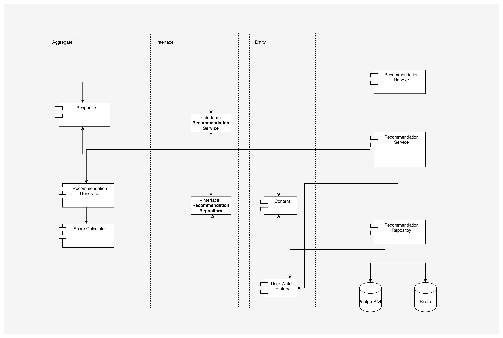
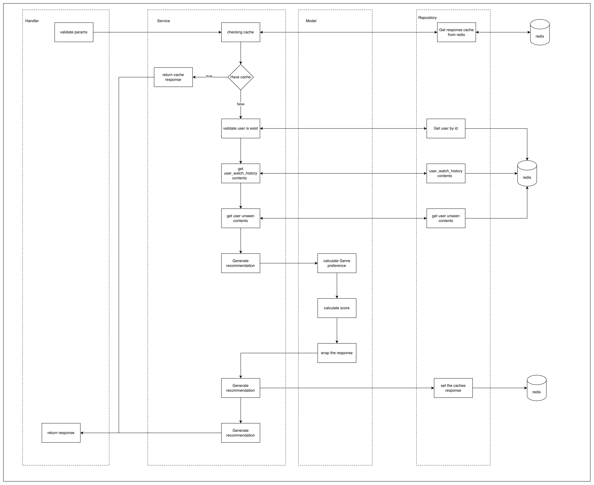

# Recommendation Service
## Setup Instructions

### How to run Seeding

1. install go
2. Run DB with command `docket compose up postgres --build` 
3. run command 
```
DATABASE_URL="host=localhost user=user password=password dbname=recommendations port=5432" go run ./migration/seeding/main.go ./migration/seeding/users.go ./migration/seeding/contents.go ./migration/seeding/user_watch_history.go
```

### How to run application

1. cd to root folder
2. run command docker compose up --build (if don't have docker, install docker first)

## How to run k6 test

1. install k6
2. run command `k6 run ${file}` for example `k6 run ./k6/user_recommendation.js`


## Architecture Overview
### High Level


This diagram indicate high level diagram of system
- **Orchestrator**: responsible for run through the process, gathering data, computing and return response.
    - **HTTP Handles**: Handle the request, set time out, validate request body/params, and return the appropriate response.
    - **Service**: orchestrate the data and transform to response
    - **Repository**: gathering and query data from data sources such as database or other API 
- **Model**: Entities and Business Logic which not mutated by outer layer. This layer will not call any layers outside.
    - **Interface**: interfaces/blueprint provided to implementor. Mainly use on dependency injection to control to data flow consistency.
    - **Entity**: Simple data structure or struct which independent from each other.
    - **Aggregate**: Gathered entity for some use case or class of business logic.
- **Utils**: Anything that is not relate to business, just help in application implement as helper.

### Dependency


This diagram explain about how component depend on each others. blank head arrow mean implement to that interface. filled head arrow mean refer to it.
- First in orchestrator they are provide the interfaces of testability (mocking ability). So, handler struct will receive interface of service instead of it exact object.
- In service, it prefer to aggregate which is Recommendation Generator to use it generate recommendation results. I move it out of service because I want to set to boundary of modules.
- Some aggregates and entities are refer to be just the struct like Content, User Watch History, Response

### Folder Structure
```
src
    ├── cmd
    ├── internal
    │   ├── handler
    │   ├── model
    │   │   ├── aggregation
    │   │   ├── entity
    │   │   └── interface
    │   ├── repository
    │   └── service
    ├── main.go
    └── utils
        ├── config
        ├── error
        └── log
```
- cmd: command to run application
- internal: orchestrator and business logic
- utils: helper

### How to get the recommendation


this diagram indicate about overview flow how to get the recommendation
- First, handler will validate the params if it is invalid it will return status 400 to user which means request is rejected.
- Next, in the service layer, we are going to check if it has cache is system, if has, return the cache response.
- If doesn't have a caches data, we will calculate the recommendation. First check if user is exist, if not return 500 with reason no user exist. Next, gathering essential data such as unseen contents, watch histories from DB for prepare to calculate score.
- Then pass the data the we gathered to modal  layer to calculate score and generate response struct. 
- After having the result. set it in redis to cache data. then return response to handler then client. 

## Design Decision

### Concurrency Approach
- I used wait group and channel to prevent the deadlock as see in `src/internal/model/aggregation/recommendation_generator.go`

## Performance Results


## Trade-offs and Future Improvements 
- Trade off the documentation, Load test is not finished due the timeline scope. Will discuss with team and do it late. Load test will need help from professional with QA team.
- Need to improve next
    - unit test
    - use cache in batch recommendation to increase speed