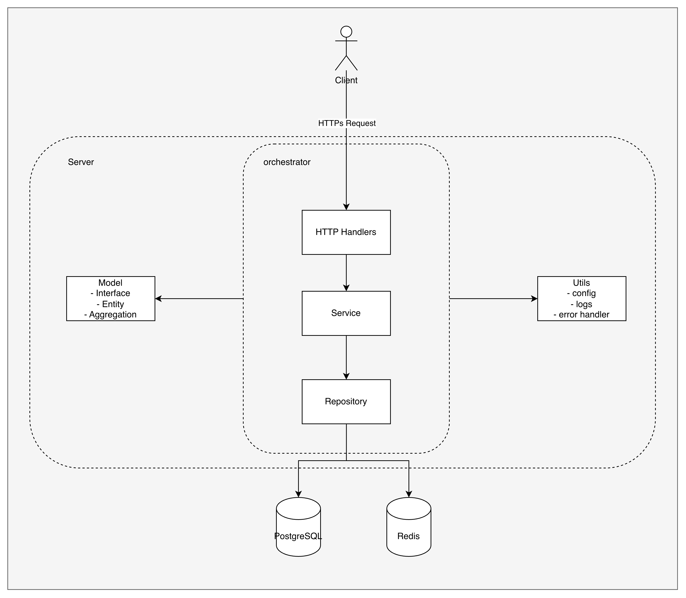

# Recommendation Service
## Setup Instructions

### How to run Seeding

1. install go
2. run command 
```
DATABASE_URL="host=localhost user=user password=password dbname=recommendations port=5432" go run ./migration/seeding/main.go ./migration/seeding/users.go ./migration/seeding/contents.go ./migration/seeding/user_watch_history.go
```


## Architecture Overview
### High Level


This diagram indicate high level diagram of system
- **Orchestrator**: responsible for run through the process, gathering data, computing and return response.
    - **HTTP Handles**: Handle the request, set time out, validate request body/params, and return the appropriate response.
    - **Service**: orchestrate the data and transform to response
    - **Repository**: gathering and query data from data sources such as database or other API 
- **Model**: Entities and Business Logic which not mutated by outer layer. This layer will not call any layers outside.
    - **Interface**: interfaces/blueprint provided to implementor. Mainly use on dependency injection to control to data flow consistency.
    - **Entity**: Simple data structure or struct which independent from each other.
    - **Aggregate**: Gathered entity for some use case or class of business logic.
- **Utils**: Anything that is not relate to business, just help in application implement as helper.

### Folder Structure
```
src
    ├── cmd
    ├── internal
    │   ├── handler
    │   ├── model
    │   │   ├── aggregation
    │   │   ├── entity
    │   │   └── interface
    │   ├── repository
    │   └── service
    ├── main.go
    └── utils
        ├── config
        ├── error
        └── log
```
- cmd: command to run application
- internal: orchestrator and business logic
- utils: helper


## Design Decision

## Performance Results

## Trade-offs and Future Improvements 